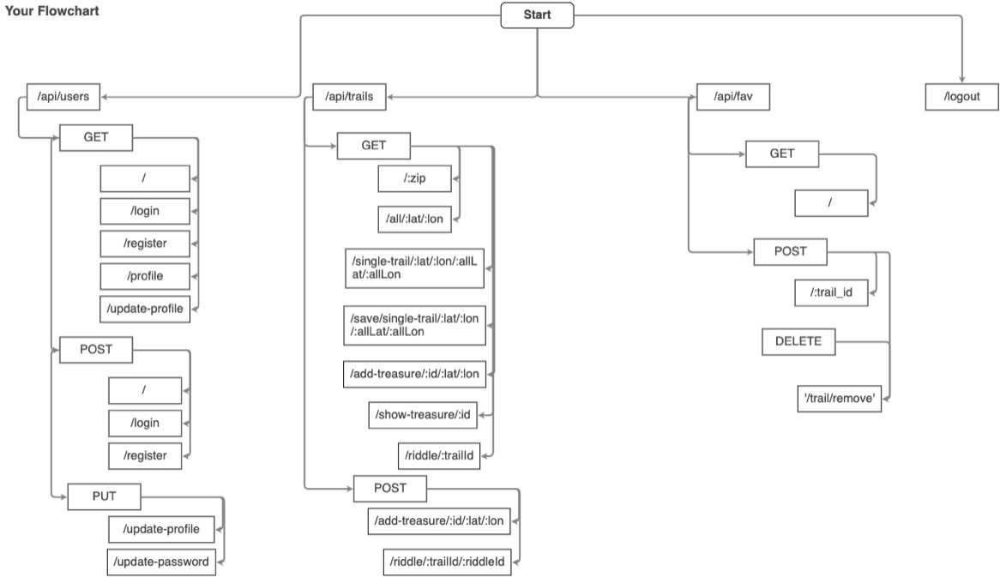

# TreasureHiker 

TreasureHiker is an application that allows it's users to search for nearby hiking trails using their zip code. It also allows users to discover and place random treasures along each trail.  

# What it looks like 
 

# Tools used for this app:

Method Override: Lets you use HTTP verbs such as PUT or DELETE in places where the client doesn't support it. 
  
bcrypt.js: password encryption 
    
Passport: Passport is authentication middleware for Node.js.  

TrailAPI: 3rd party API for getting trail data based on lat and lon
  
ZipcodeAPI: 3rd party api used to get lat/lon based on zipcode.
  
Axios: a Javascript library used to make HTTP requests from node.js 
  

# Available Routes...
  

* / - main page accessible without being logged in
* /logout - logs user out and destroys session 
* /api/users 
    * GET
        * /login - User login
        * /register - User Register
        * /profile - User can see profile
        * /update-profile - User can see options to change name/password/etc.
    * POST
        * / - home page when logged in where users can search by zip code.
        * /login - submits login form and checks database for existing user 
        * /register - submits Register form and checks database for existing user. if none, user is saved to database
    * PUT
        * /update-profile - submits new profile information to database 
        * /update-password - submits new password information to database
* /api/trails 
    * GET
        * /all/:lat/:lon - makes a call to api and displays all trails based on zip given
        * /single-trail/:lat/:lon/:allLat/:allLon - shows single trail
        * /save/single-trail/:lat/:lon/:allLat/:allLon - saves single trail to database
        * /add-treasure/:id/:lat/:lon - shows form to add treasure for the trail
        * /show-treasure/:id - shows all treasure on the trail 
        * /riddle/:trailId - displays a riddle for the user to solve
    * POST
        * /add-treasure/:id/:lat/:lon - adds treasure to trail in the database
        * /riddle/:trailId/:riddleId - checks user answer to riddle, redirects to show treasure if correct
* /api/fav 
    * GET
        * / - shows user favorites
    * POST
        * /:trail_id - adds a trail to users favorites
    * DELETE
        * '/trail/remove' -  removes a trail from users favorites

# Future Features  

* Allowing users to add new trails.
* Coverting location/description of treasure to pirate talk using a 3rd part api.
* Allowing users to upload pics of treasure or for their profile.
* Adding a div to the riddles page that will give the user a hint if they are stuck
* Having the app return more trail results and then using pagination. 

# Where the app is hosted.  
https://hurl2526-hiker-deploy.herokuapp.com/

# How to make it work locally:
1. Fork and clone repo
2. Install all dependencies 
3. Create .env file in the root  
    * Populate with the following
        * PORT = the port you would like to use
        * SESSION_SECRET = 'any string'
        * MONGODB_URI = 'path to your mongo storage'
4. To launch server type: node ./bin/www

# Contributors

@hurl2526 📖

### Contact
If you want to contact me you can reach me at patrick.hurley@codeimmersives.com